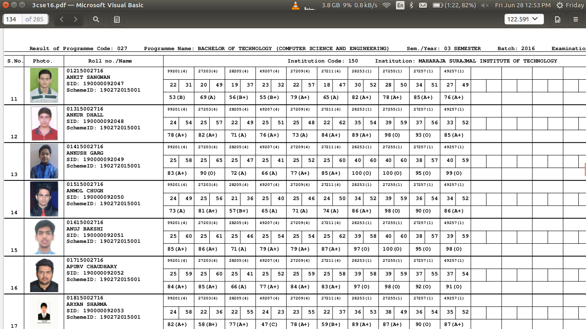
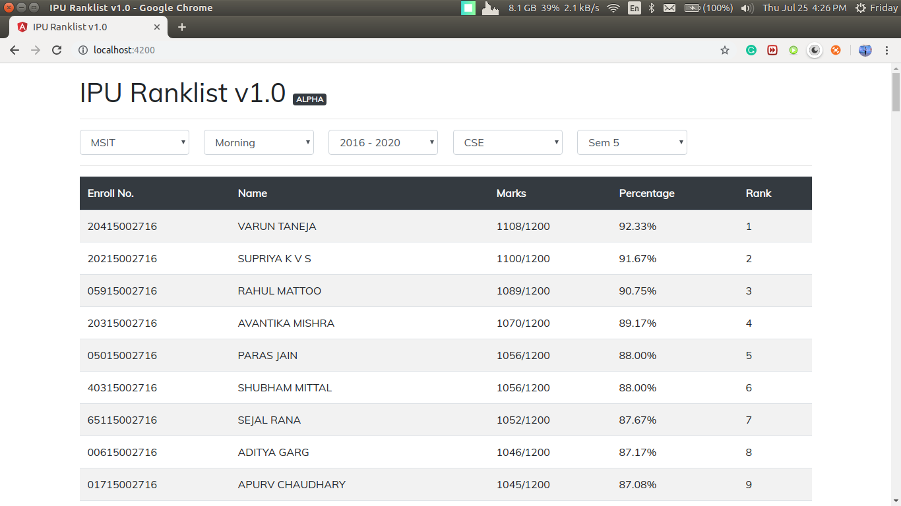

# ipu-ranklist v2.0

Please visit the deployed application [here](http://ipuranklist.surge.sh/).

## So why a ranklist app?
So the idea is simple. We recieve our semester-wise results in the form of a pdf, which looks like this:

There's Roll Number-wise, Subject-wise result of each and every student studying in a branch (CSE for instance) in the entire university (that's right, not just one college). Neither total marks nor percentage is displayed, let alone a ranklist. Even the subject names are not shown corresponding to the marks.

So this is a minimalist result website I'm making for our University students, in which they can see their class-rank, percentage and subject-wise marks.

## Completed and Working features
*Please raise an issue instantly if you find something wrong with these features*
- Ranklists of all Engineering Colleges in IP University, that are displayed on selection of
  - **College** *(Ex: MSIT, MAIT, BVCOE...)*, 
  - **Shift** *(Ex: Morning, Evening, Both)*, 
  - **Batch** *(Ex: 2016-20, 2017-21...)*, 
  - **Course** *(Ex: BTech, BCA, BBA), and
  - **Semester** *(Ex: Sem1, Sem2, Sem3...)*
- Subject-wise marks when clicked on any name in the ranklist.
- A search-box to find a Student/Enrollment Number in the displayed ranklist.
- CGPA & credit-percentage also shown with subject-wise marks.
- An overall section for semesters, that shows cumulative percentage till now and even cumulative CGPA.
- A profile page that shows all the history of a single student including, subject-wise, semester-wise marks and CGPA.
- Overall section in Student Profile.

## Planned Features
- An overall section for institutes, that shows a ranklist which includes students from all the colleges of a particular branch.
- Ranks in the profile section.

## Structure of the application
Alright, So lets start the story with what you see. The front-end you see deployed at http://ipuranklist.surge.sh is actually an Angular application, the code for which can be found in the client directory. This angular application gets data by making GET requests to an API which is written in Node.js(using express) and it's code can be found in the server directory. This API in-turn interacts with a MongoDB on which all the data is stored.

#### Deployment
The angular application as you can see is deployed on surge. The API is deployed on an EC2 instance on AWS. The MongoDB was earlier deployed on Mlab, but now has been moved to the same EC2 instance.

#### Jimmy
Everything mentioned above is just a classic web application. Nothing new. What makes this project special is how do I bring the student's data from Result PDFs to a database? Everytime results are announced (i.e. twice a year), 52 PDFs are released. (13 branches x 4 years). Now since all of these 52 PDFs are different, and all that the PDF reading library offers is an array of strings for each page it reads. 

Now, only from these raw text strings, I needed to generate meaningful data. But this is not an easy task, because in a single PDF there are hundreds of pages, thousands of students from different colleges. And the biggest problem is how inconsistent this data is. There are pages in the pdf which are blank, there are pages which only have info about subjects, there are students who didn't attend the exam, there are students who were given grace marks for passing, there are students from previous years giving back exams, there are, well, you get it... there are a lot of exceptions to handle and the data is really sensitive. I mean there's a high chance, I might end up showing someone else's marks under someone else's name, which will not only fail the purpose of the app, but also get me beaten up :fist_oncoming: at my own college :no_mouth:.

So, to handle this painful but logical task I wrote a parser. Let's call it Jimmy. This parser gets a name for itself because, it was very difficult to code and took a very long time to perfect. Now what Jimmy does is, it takes this inconsistent raw data page-by-page from a PDF and parses into meaningful array of objects, each object containing data and marks of a student. *Jimmy's CODE is not public right now for obvious reasons*. :speak_no_evil:. But this is how the data from Result PDFs goes into my database.

## Contributions
If there's a feature you'd want in this app or if there's something you might not like, and would want changed, feel free to raise an issue or comment on a previous one. Questions, Suggestions, Ideas, Complaints or even if it is some random banter, you'd like to discuss. Reach me out. 😄

## History
Before starting with this application I created an [MSIT Ranklist web-app for Fall'18 results](http://msitranklist.surge.sh/), which went exceptionally viral in MSIT and received more than 500 hits within the first two hours of launch. It has received **12,000+ hits** uptil now, which essentially inspired me create one for entire IP University. See the story of how I ended up making that application [here](https://github.com/ankushgarg1998/msit-ranklist).
